# 🏢 Enterprise DevSecOps Pipeline (Ministack + EC2 Mock)

[](https://github.com/lukmanulhakimdevops/devops_practical_test_ministack-local-ci-cd-aws-mock/actions)
[](#)
[](#)
[](#)

Proyek ini merupakan implementasi **DevSecOps CI/CD** tingkat lanjut yang mensimulasikan *deployment* aplikasi .NET ke lingkungan **AWS Mock** menggunakan **Ministack**, lengkap dengan *provisioning* infrastruktur (EC2, RDS, S3) melalui **Terraform**. Pipeline menerapkan 5 lapisan pertahanan keamanan (*Shift-Left Security*) sebelum aplikasi akhirnya berjalan sebagai kontainer di dalam *self-hosted runner* (laptop/server lokal) yang berperan sebagai **EC2 Mock Instance**.

---

## 📌 Daftar Isi

- [Tentang Proyek](#tentang-proyek)
- [Arsitektur DevSecOps 5-Layer](#arsitektur-devsecops-5-layer)
- [Teknologi yang Digunakan](#teknologi-yang-digunakan)
- [Prasyarat](#prasyarat)
- [Cara Menggunakan](#cara-menggunakan)
- [Penjelasan Workflow (Jobs)](#penjelasan-workflow-jobs)
- [Struktur Repositori](#struktur-repositori)
- [Kontribusi & Lisensi](#kontribusi--lisensi)

---

## Tentang Proyek

**Enterprise DevSecOps Pipeline** ini dirancang untuk menunjukkan praktik terbaik dalam mengamankan *software supply chain* menggunakan **GitHub Actions**. Selain melakukan *build* dan *deploy*, pipeline ini mengintegrasikan:

- **Pembuatan Infrastruktur Mock**: Terraform membuat EC2, RDS, dan S3 di **Ministack** (AWS API Mock).
- **EC2 Mock Container**: Sebuah kontainer Docker bertindak sebagai "EC2 Instance" yang menjalankan aplikasi .NET di dalamnya, memberikan ilusi deployment ke VM sungguhan.
- **5 Lapisan Keamanan** yang dijalankan secara berurutan, di mana kegagalan di satu lapisan akan menghentikan proses deployment.

Proyek ini cocok untuk keperluan **edukasi, demonstrasi, dan pengujian** pipeline DevSecOps tanpa harus mengeluarkan biaya infrastruktur cloud sungguhan.

---

## Arsitektur DevSecOps 5-Layer

```mermaid
flowchart LR
    subgraph GH [GitHub-Hosted Runner]
        A[Checkout Code] --> B[🔍 Linting & Format]
        B --> C[🛡️ SAST & Secrets<br/>Gitleaks + CodeQL]
        C --> D[📦 SCA & SBOM<br/>NuGet Audit]
        D --> E[🔨 Build & Unit Test]
        E --> F[🐳 Container Build & Trivy Scan]
    end

    subgraph SHR [Self-Hosted Runner - Laptop]
        G[🏗️ Terraform Apply<br/>Create EC2, RDS, S3 in Ministack]
        H[🐳 Run EC2 Mock Container]
        I[📦 Deploy App inside EC2 Mock]
        J[🕷️ OWASP ZAP DAST Scan]
    end

    F --> G
    G --> H --> I --> J
    J --> K((✅ Deployed to Production))

    style C fill:#d73a49,color:#fff
    style D fill:#d73a49,color:#fff
    style F fill:#d73a49,color:#fff
    style J fill:#d73a49,color:#fff
    style K fill:#28a745,color:#fff
```

Berikut diagram alir pipeline yang menunjukkan tahapan keamanan dan deployment:



### 🧱 Penjelasan 5 Lapisan Keamanan

| Lapisan | Nama | Tools | Keterangan |
|--------|------|-------|------------|
| **1** | **Secret Scanning** | Gitleaks | Mencegah *hardcoded secrets* masuk ke repositori. |
| **2** | **SAST** | CodeQL | Analisis kode statis untuk mencari kerentanan (CWE) di kode C#. |
| **3** | **SCA** | `dotnet list package` & OWASP DC | Mendeteksi kerentanan di *third-party libraries* (NuGet). |
| **4** | **Container Scan** | Trivy | Memindai *Docker Image* dari kerentanan OS dan *application dependencies*. Pipeline akan **gagal** jika ditemukan isu **CRITICAL** atau **HIGH**. |
| **5** | **DAST** | OWASP ZAP | Menyerang aplikasi yang sedang berjalan (*running container*) untuk menemukan celah keamanan dinamis (XSS, SQLi, misconfigurations). |

---

## Teknologi yang Digunakan

| Komponen            | Teknologi / Tools                                      |
| ------------------- | ------------------------------------------------------ |
| CI/CD               | GitHub Actions                                         |
| Bahasa & Framework  | .NET 8 (C#), ASP.NET Core Web API                      |
| SAST                | CodeQL, Gitleaks                                       |
| SCA                 | OWASP Dependency Check, CycloneDX (SBOM)               |
| Container Scanner   | AquaSecurity Trivy                                     |
| DAST Scanner        | OWASP ZAP (Zed Attack Proxy)                           |
| Infrastruktur Mock  | Ministack (AWS API Mock)                               |
| Provisioning        | Terraform                                              |
| Containerization    | Docker, Docker-in-Docker (DinD), Alpine Linux          |
| Runner              | GitHub-Hosted (`ubuntu-latest`) + Self-Hosted (Linux x64) |

---

## Prasyarat

### Untuk Self-Hosted Runner (Laptop/Server)

Pastikan mesin yang menjadi *self-hosted runner* memenuhi syarat berikut:

1. **GitHub Actions Runner** terdaftar dengan label `self-hosted, linux, x64`.
2. **Docker Engine** terinstal dan user yang menjalankan runner memiliki akses ke *Docker daemon* (tanpa `sudo`).
3. **Ministack** berjalan sebagai kontainer Docker dengan port `4566` terbuka.
   ```bash
   docker run -d --name ministack -p 4566:4566 nahuelnucera/ministack:latest
   ```
4. **AWS CLI** (opsional, untuk verifikasi; Terraform akan menggunakannya secara internal).

### Secret GitHub yang Harus Diatur

Tambahkan secret berikut di **Settings → Secrets and variables → Actions**:

| Secret Name              | Contoh Nilai                | Deskripsi                                   |
| ------------------------ | --------------------------- | ------------------------------------------- |
| `AWS_ACCESS_KEY_ID`      | `dummy`                     | Kunci akses AWS untuk Ministack             |
| `AWS_SECRET_ACCESS_KEY`  | `dummy`                     | Kunci rahasia AWS untuk Ministack           |
| `DB_USER`                | `tempAdmin`                 | Username untuk RDS mock                     |
| `DB_PASSWORD`            | `!tempAdmin954*`            | Password untuk RDS mock                     |
| `LOCALSTACK_ENDPOINT`    | `http://localhost:4566`     | Endpoint Ministack (default)                |

> **Catatan**: Secret `S3_BUCKET`, `EC2_HOST`, `RDS_ENDPOINT` tidak diperlukan secara langsung karena nilainya dihasilkan oleh Terraform.

---

## Cara Menggunakan

### 1. Clone Repositori
```bash
git clone git@github.com:lukmanulhakimdevops/devops_practical_test_ministack-local-ci-cd-aws-mock.git
cd devops_practical_test_ministack-local-ci-cd-aws-mock
```

### 2. Setup Secret dengan GitHub CLI
```bash
gh auth login

gh secret set AWS_ACCESS_KEY_ID     --body "dummy"
gh secret set AWS_SECRET_ACCESS_KEY --body "dummy"
gh secret set DB_USER               --body "tempAdmin"
gh secret set DB_PASSWORD           --body "!tempAdmin954*"
gh secret set LOCALSTACK_ENDPOINT   --body "http://localhost:4566"
```

### 3. Jalankan Self-Hosted Runner
Ikuti instruksi dari GitHub (**Settings → Actions → Runners → New self-hosted runner**) untuk mendaftarkan runner di laptop Anda. Pastikan runner memiliki label `self-hosted, linux, x64`.

### 4. Trigger Pipeline

- **Otomatis**: Setiap *push* ke branch `main` atau `develop` pada path `TodoWebAPI/**`.
- **Manual**: Buka tab **Actions** → pilih workflow **Enterprise DevSecOps Pipeline** → **Run workflow** → pilih *environment* (`staging` atau `production`).

---

## Penjelasan Workflow (Jobs)

Workflow ini dibagi menjadi beberapa job yang saling bergantung:

| Job | Runner | Deskripsi Singkat |
|-----|--------|-------------------|
| `lint` | `ubuntu-latest` | Memformat kode C# dan otomatis commit jika ada perubahan. |
| `sast` | `ubuntu-latest` | Menjalankan Gitleaks dan CodeQL untuk analisis keamanan statis. |
| `sca` | `ubuntu-latest` | Memindai dependensi rentan dan menghasilkan SBOM. |
| `build` | `ubuntu-latest` | Melakukan *build*, *unit test*, dan mempublikasikan *artifact* `.zip`. |
| `container` | `ubuntu-latest` | Membangun *Docker image*, memindai dengan Trivy, dan menghasilkan SBOM kontainer. |
| `infra` | `self-hosted` | Membuat infrastruktur mock (EC2, RDS, S3) di Ministack menggunakan Terraform. |
| `deploy-staging` | `self-hosted` | Menjalankan kontainer **EC2 Mock**, men-deploy aplikasi .NET di dalamnya, dan melakukan *DAST scan* dengan OWASP ZAP. |
| `deploy-prod` | `self-hosted` | Sama seperti staging, tetapi menggunakan port berbeda dan **memerlukan approval manual** (via Environment Protection Rules). |
| `notify` | `ubuntu-latest` | Memberikan ringkasan status deployment (dapat diperluas ke Slack). |

### Detail Penting Job `deploy-*`

1. **EC2 Mock Container**: Kontainer `alpine` yang menjalankan *Docker daemon* di dalamnya (DinD). Aplikasi `todo-webapi` dijalankan di dalam kontainer ini sehingga seolah-olah berjalan di EC2 instance.
2. **DAST Scan**: OWASP ZAP dijalankan dengan perintah `zap-baseline.py -t http://localhost:8080 -l FAIL`. Jika ditemukan kerentanan level `FAIL`, pipeline akan gagal dan aplikasi dihentikan.

---

## Struktur Repositori

```
.
├── .github/
│   └── workflows/
│       └── dotnet.yml                # Workflow utama
├── TodoWebAPI/                       # Kode sumber aplikasi .NET
│   ├── Controllers/
│   ├── Data/
│   ├── Models/
│   ├── Program.cs
│   └── TodoWebAPI.csproj
├── terraform/                        # (Opsional, jika tidak digenerate otomatis)
│   ├── main.tf
│   ├── variables.tf
│   └── outputs.tf
├── ec2-mock.Dockerfile               # (Digenerate otomatis oleh workflow)
├── ec2-mock-entrypoint.sh            # (Digenerate otomatis oleh workflow)
└── README.md
```

> **Catatan**: File Terraform dan Dockerfile untuk EC2 Mock **dibuat secara dinamis** oleh workflow, sehingga Anda tidak perlu menyediakannya secara manual.

---

## Kontribusi & Lisensi

Proyek ini terbuka untuk kontribusi dalam bentuk *Pull Request*. Silakan buat *issue* terlebih dahulu untuk mendiskusikan perubahan besar.

Didistribusikan di bawah lisensi **MIT License**. Lihat file [LICENSE](LICENSE) untuk informasi lebih lanjut.
