# 🏢 Enterprise DevSecOps Pipeline (Ministack + EC2 Mock)

[](https://github.com/lukmanulhakimdevops/devops_practical_test_ministack-local-ci-cd-aws-mock/actions)
[](#)
[](#)
[](#)

Proyek ini merupakan **Cetak Biru (Blueprint) Arsitektur DevSecOps Tingkat Enterprise**. 

Pipeline ini mendemonstrasikan orkestrasi *deployment* aplikasi .NET ke dalam ekosistem **AWS Mock (Ministack)**. Menggunakan **Terraform** untuk otomatisasi *provisioning* (EC2, RDS, S3) dan menerapkan standar **5-Layer Shift-Left Security**. Setiap integrasi kode harus melewati validasi keamanan yang ketat sebelum diizinkan untuk di-*deploy* ke *self-hosted runner* (lingkungan lokal) yang disimulasikan sebagai **EC2 Mock Instance**.

---

## 📌 Daftar Isi

- [Ringkasan Eksekutif](#ringkasan-eksekutif)
- [Arsitektur DevSecOps 5-Layer](#arsitektur-devsecops-5-layer)
- [Stack Teknologi](#stack-teknologi)
- [Prasyarat Sistem](#prasyarat-sistem)
- [Panduan Eksekusi](#panduan-eksekusi)
- [Rincian Workflow (Jobs)](#rincian-workflow-jobs)
- [Struktur Repositori](#struktur-repositori)

---

## Ringkasan Eksekutif

Arsitektur ini dirancang untuk memastikan *software supply chain* yang sangat aman dan resilien melalui kapabilitas **GitHub Actions**:

- **Infrastructure as Code (IaC):** Terraform digunakan untuk menginisiasi topologi infrastruktur (EC2, RDS, S3) langsung ke **Ministack** (layanan AWS API Mock).
- **Simulasi EC2:** Aplikasi .NET tidak berjalan secara *bare-metal*, melainkan diisolasi di dalam kontainer Docker khusus yang bertindak sebagai "EC2 Instance" (*Docker-in-Docker*).
- **Security Gates:** 5 lapisan keamanan berjalan secara sekuensial. Jika terdapat temuan dengan tingkat severity *HIGH* atau *CRITICAL*, seluruh proses *deployment* akan dihentikan secara otomatis (*fail-fast*).

---

## Arsitektur DevSecOps 5-Layer

```mermaid
flowchart LR
    subgraph GH [GitHub-Hosted Runner]
        A[Checkout Code] --> B[🔍 Linting & Format]
        B --> C[🛡️ SAST & Secrets<br/>Gitleaks + CodeQL]
        C --> D[📦 SCA & SBOM<br/>NuGet Audit]
        D --> E[🔨 Build & Unit Test]
        E --> F[🐳 Container Build & Trivy Scan]
    end

    subgraph SHR [Self-Hosted Runner - Laptop]
        G[🏗️ Terraform Apply<br/>Create EC2, RDS, S3 in Ministack]
        H[🐳 Run EC2 Mock Container]
        I[📦 Deploy App inside EC2 Mock]
        J[🕷️ OWASP ZAP DAST Scan]
    end

    F --> G
    G --> H --> I --> J
    J --> K((✅ Deployed to Production))

    style C fill:#d73a49,color:#fff
    style D fill:#d73a49,color:#fff
    style F fill:#d73a49,color:#fff
    style J fill:#d73a49,color:#fff
    style K fill:#28a745,color:#fff
```



### 🧱 5 Security Gates (Lapisan Keamanan)

| Tahap | Tools | Deskripsi Fungsional |
|--------|------|------------|
| **1: Secret Scan** | Gitleaks | Memblokir kebocoran *hardcoded password*, token, atau API Keys pada riwayat *commit*. |
| **2: SAST** | CodeQL | Melakukan analisis statis pada source code C# untuk mengidentifikasi kerentanan logika (CWE). |
| **3: SCA** | `dotnet list` & CycloneDX | Mengaudit dependensi pihak ketiga (NuGet) dari kerentanan publik dan menghasilkan dokumen SBOM. |
| **4: Container Scan**| Trivy | Memindai *Docker Image* (berbasis Alpine). Menghentikan pipeline jika terdeteksi kerentanan **CRITICAL/HIGH**. |
| **5: DAST** | OWASP ZAP | Melakukan pemindaian dinamis terhadap aplikasi yang sedang berjalan untuk mengidentifikasi celah seperti XSS atau SQLi. |

---

## Stack Teknologi

| Komponen Arsitektur | Teknologi yang Digunakan |
| ------------------- | ------------------------------------------------------ |
| **Orkestrasi CI/CD** | GitHub Actions                                         |
| **Aplikasi Utama** | .NET 8 (C#), ASP.NET Core Web API                      |
| **Static Security (SAST/SCA)**| CodeQL, Gitleaks, OWASP Dependency Check, CycloneDX    |
| **Dynamic Security (DAST)**| AquaSecurity Trivy, OWASP ZAP (Zed Attack Proxy)       |
| **Target Environment** | Ministack (Local AWS API Mock)                         |
| **IaC Automation** | HashiCorp Terraform                                    |
| **Containerization**| Docker, Docker-in-Docker (DinD), Alpine Linux          |
| **Runners** | GitHub-Hosted (`ubuntu-latest`) & Self-Hosted (Linux)  |

---

## Prasyarat Sistem

### Persiapan Self-Hosted Runner

Mesin target (Server/Laptop lokal) wajib memenuhi spesifikasi berikut:

1. **GitHub Actions Runner** aktif dengan label lingkungan: `self-hosted, linux, x64`.
2. **Docker Engine** beroperasi penuh dan *user* yang menjalankan runner memiliki hak akses *daemon* (tanpa `sudo`).
3. **Ministack** beroperasi pada *port* `4566`:
   ```bash
   docker run -d --name ministack -p 4566:4566 nahuelnucera/ministack:latest
   ```

### Konfigurasi GitHub Secrets

Tambahkan variabel berikut pada menu **Settings → Secrets and variables → Actions**:

| Nama Secret | Contoh Nilai | Deskripsi Fungsional |
| ------------------------ | --------------------------- | ------------------------------------------- |
| `AWS_ACCESS_KEY_ID`      | `dummy`                     | Kredensial akses untuk Ministack |
| `AWS_SECRET_ACCESS_KEY`  | `dummy`                     | Kredensial rahasia untuk Ministack |
| `DB_USER`                | `tempAdmin`                 | Username untuk autentikasi RDS Mock |
| `DB_PASSWORD`            | `!tempAdmin954*`            | Password untuk autentikasi RDS Mock |
| `LOCALSTACK_ENDPOINT`    | `http://localhost:4566`     | URL Endpoint untuk integrasi Ministack |

*(Catatan: Variabel `S3_BUCKET`, `EC2_HOST`, dan `RDS_ENDPOINT` akan dihasilkan dan dikelola secara dinamis oleh Terraform selama runtime).*

---

## Panduan Eksekusi

### 1. Kloning Repositori
```bash
git clone git@github.com:lukmanulhakimdevops/devops_practical_test_ministack-local-ci-cd-aws-mock.git
cd devops_practical_test_ministack-local-ci-cd-aws-mock
```

### 2. Setup Kredensial via GitHub CLI
```bash
gh auth login

gh secret set AWS_ACCESS_KEY_ID     --body "dummy"
gh secret set AWS_SECRET_ACCESS_KEY --body "dummy"
gh secret set DB_USER               --body "tempAdmin"
gh secret set DB_PASSWORD           --body "!tempAdmin954*"
gh secret set LOCALSTACK_ENDPOINT   --body "http://localhost:4566"
```

### 3. Menjalankan Pipeline
- **Trigger Otomatis:** Pipeline dipicu secara otomatis setiap terdapat aktivitas *Push/Merge* ke branch `main` atau `develop`.
- **Eksekusi Manual:** Navigasi ke tab **Actions** → pilih **Enterprise DevSecOps Pipeline** → klik **Run workflow** → Tentukan *environment* target (`staging` atau `production`).

---

## Rincian Workflow (Jobs)

| Job | Runner | Deskripsi Tugas |
|-----|--------|-------------------|
| `lint` | `ubuntu-latest` | Memvalidasi standar format kode C#. |
| `sast` | `ubuntu-latest` | Memindai *hardcoded secrets* (Gitleaks) dan kerentanan source code (CodeQL). |
| `sca` | `ubuntu-latest` | Mengaudit dependensi eksternal dan menghasilkan SBOM (Software Bill of Materials). |
| `build` | `ubuntu-latest` | Mengkompilasi aplikasi .NET menjadi *artifact* siap *deploy* (`.zip`). |
| `container` | `ubuntu-latest` | Membangun *Docker Image* dan menjalankan inspeksi kerentanan dengan Trivy. |
| `infra` | `self-hosted` | Mengeksekusi Terraform untuk mem-*provisioning* EC2, RDS, dan S3 di Ministack. |
| `deploy-staging` | `self-hosted` | Menjalankan *container* simulasi EC2, menginstal aplikasi, dan menjalankan verifikasi DAST. |
| `deploy-prod` | `self-hosted` | Proses identik dengan *staging*, namun dilindungi oleh **Manual Approval Gate**. |
| `notify` | `ubuntu-latest` | Mengirimkan telemetri dan ringkasan status operasi pipeline (dapat diintegrasikan ke Slack/Email). |

---

## Struktur Repositori

```text
.
├── .github/
│   └── workflows/
│       └── dotnet.yml                # Konfigurasi utama CI/CD Pipeline
├── TodoWebAPI/                       # Source code aplikasi .NET Core
│   ├── Controllers/
│   ├── Data/
│   ├── Models/
│   ├── Program.cs
│   └── TodoWebAPI.csproj
├── terraform/                        # Blueprint IaC (Dibuat secara dinamis jika tidak ada)
├── ec2-mock.Dockerfile               # (Digenerate otomatis oleh pipeline)
├── ec2-mock-entrypoint.sh            # (Digenerate otomatis oleh pipeline)
└── README.md
```

---

## Kontribusi & Lisensi

Proyek ini dibangun berdasarkan prinsip arsitektur terbuka. Kontribusi melalui *Pull Request* sangat dipersilakan. Untuk perubahan yang signifikan, harap membuka *Issue* terlebih dahulu untuk tahap diskusi arsitektural.

Didistribusikan di bawah lisensi **MIT License**. Silakan lihat file [LICENSE](LICENSE) untuk informasi lebih detail.
