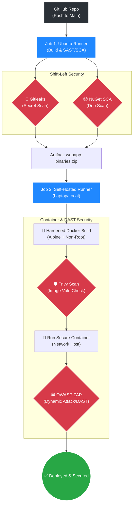

# 🛡️ DevSecOps Ministack CI/CD with Docker & DAST

[](https://github.com/lukmanulhakimdevops/devops_practical_test_ministack-local-ci-cd-aws-mock/actions)
[](#)
[](#)

Proyek ini merupakan purwarupa (prototype) pipeline **DevSecOps CI/CD** menggunakan **GitHub Actions**. Pipeline ini tidak hanya melakukan build dan deploy, tetapi menerapkan doktrin **Shift-Left Security** melalui 5 lapisan pertahanan (SAST, SCA, Hardened Image, Container Scan, dan DAST) sebelum aplikasi .NET dijalankan sebagai kontainer di dalam *self-hosted runner* (Laptop/Server Lokal).

---

## 📌 Daftar Isi

- [Tentang Proyek](#tentang-proyek)
- [Arsitektur DevSecOps 5-Layer](#arsitektur-devsecops-5-layer)
- [Teknologi yang Digunakan](#teknologi-yang-digunakan)
- [Prasyarat](#prasyarat)
- [Cara Menggunakan](#cara-menggunakan)
- [Penjelasan Workflow](#penjelasan-workflow)
- [Kontribusi & Lisensi](#kontribusi--lisensi)

---

## Tentang Proyek

**DevSecOps Ministack** adalah implementasi taktis yang menyimulasikan *deployment* ke infrastruktur cloud (AWS Mock) sembari melakukan *deployment* aktual ke Docker lokal. 

Proyek ini menyoroti **5 Lapisan Keamanan (Security Layers)**:
1. **Secret Scanning (SAST):** Menggunakan *Gitleaks* untuk mencegah kebocoran *credential* atau API Key di repositori.
2. **Software Composition Analysis (SCA):** Memindai kerentanan (CVE) pada dependensi paket NuGet .NET.
3. **Hardened Dockerfile:** Menggunakan *base image* Alpine Linux dan menjalankan kontainer sebagai *non-root user* untuk meminimalisasi *attack surface*.
4. **Container Image Scanning:** Menggunakan *Trivy* untuk memindai *Docker Image* sebelum di-*deploy*. Pipeline akan gagal (patah) jika ditemukan kerentanan level `HIGH` atau `CRITICAL`.
5. **Dynamic Application Security Testing (DAST):** Menggunakan *OWASP ZAP* untuk menyerang kontainer yang sedang berjalan secara *real-time* guna memastikan tidak ada celah eksploitasi dari luar (XSS, SQLi, dll).

---

## Arsitektur DevSecOps 5-Layer



---

## Teknologi yang Digunakan

| Komponen            | Teknologi / Tools                          |
| ------------------- | ------------------------------------------ |
| CI/CD               | GitHub Actions                             |
| Bahasa & Framework  | .NET 8 (C#)                                |
| SAST / Secret Scan  | Gitleaks                                   |
| Container Scanner   | AquaSecurity Trivy                         |
| DAST Scanner        | OWASP ZAP (Zed Attack Proxy)               |
| Containerization    | Docker, Alpine Linux                       |
| Cloud (Mock)        | AWS CLI (S3, EC2, RDS Dummy Credentials)   |

---

## Prasyarat

Sebelum mengeksekusi pipeline ini, pastikan infrastruktur lokal (*runner*) Anda memiliki:

1. **GitHub Self-Hosted Runner** yang sudah aktif dan terhubung ke repositori.
2. **Docker Engine** terinstal dan berjalan pada mesin *runner*.
3. **Unzip** terinstal pada mesin *runner*.
4. Akun **GitHub CLI (`gh`)** untuk konfigurasi rahasia (*secrets*).

---

## Cara Menggunakan

### 1. Konfigurasi Repositori
Clone repositori ini ke mesin lokal Anda:
```bash
git clone git@github.com:lukmanulhakimdevops/devops_practical_test_ministack-local-ci-cd-aws-mock.git
cd devops_practical_test_ministack-local-ci-cd-aws-mock
```

### 2. Atur Secrets (Mock Cloud & GitHub)
Gunakan GitHub CLI untuk menginjeksi variabel *secrets* yang dibutuhkan oleh *mock pipeline*:
```bash
gh auth login

gh secret set AWS_ACCESS_KEY_ID     --body "dummy"
gh secret set AWS_SECRET_ACCESS_KEY --body "dummy"
gh secret set S3_BUCKET             --body "mock-bucket"
gh secret set EC2_HOST              --body "localhost"
gh secret set RDS_ENDPOINT          --body "localhost:3306"
gh secret set DB_NAME               --body "mockdb"
gh secret set DB_USER               --body "mockuser"
gh secret set DB_PASSWORD           --body "mockpass"
```

### 3. Eksekusi Workflow
Setiap *push* ke branch `main` akan secara otomatis memicu peluncuran rudal CI/CD. Untuk peluncuran manual:
```bash
gh workflow run "🛡️ DevSecOps Ministack CI/CD"
```

---

## Penjelasan Workflow (Jobs & Steps)

Pipeline ini dibagi menjadi dua formasi tempur (*Jobs*):

### Job 1: `security_and_build` (berjalan di GitHub Ubuntu)
| Step | Taktik / Operasi | Deskripsi |
|---|---|---|
| 1 | **Secret Scanning** | Menjalankan Gitleaks untuk memastikan tidak ada *password* atau *token* yang tertinggal di kode. |
| 2 | **SCA NuGet Audit** | Memindai dependensi .NET dari celah kerentanan (CVE). |
| 3 | **Build & Zip** | Melakukan kompilasi `.dll` dan membungkusnya menjadi *artifact* `webapp-binaries.zip`. |
| 4 | **AWS Mocking** | Mensimulasikan *upload* ke S3 dan injeksi *environment* ke EC2. |

### Job 2: `deploy` (berjalan di Self-Hosted Runner / Laptop)
| Step | Taktik / Operasi | Deskripsi |
|---|---|---|
| 1 | **Hardened Dockerfile** | Membuat Dockerfile secara dinamis menggunakan base *Alpine* dan menetapkan *non-root user* (appuser). |
| 2 | **Trivy Image Scan** | Memindai kontainer yang baru di-*build*. Jika ada celah *CRITICAL*, pipeline **DIGAGALKAN**. |
| 3 | **Secure Run** | Menjalankan kontainer dengan parameter `--security-opt="no-new-privileges:true"`. |
| 4 | **DAST (OWASP ZAP)** | Menembakkan proksi penyerang ke aplikasi yang berjalan untuk menguji ketahanan dari luar. Kontainer akan **DIHANCURKAN** jika ditemukan celah eksploitasi fatal. |

---

## Kontribusi & Lisensi

Proyek ini dibangun sebagai demonstrasi arsitektur **Enterprise DevSecOps**. Kontribusi dalam bentuk *Pull Request* sangat dipersilakan.

Didistribusikan di bawah lisensi [MIT License](LICENSE).
